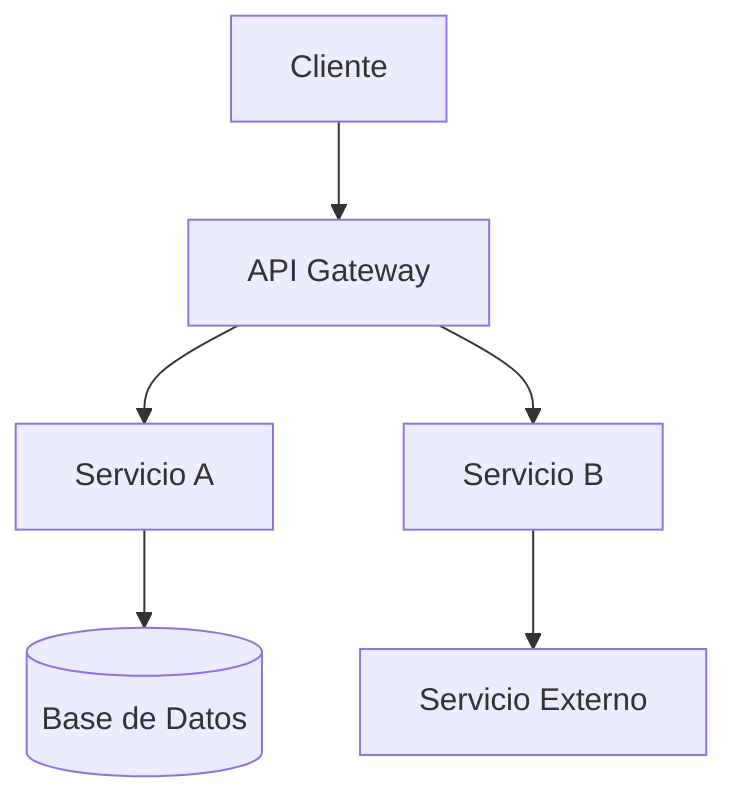

# Template: ARCHITECTURE.md

Usa esta plantilla cuando el usuario solicite crear o actualizar `ARCHITECTURE.md` en `docs/`.

## Estructura

```markdown
# 🏗️ Arquitectura Técnica

## Diagrama de Sistema


```

## Flujo de Datos

Describe los flujos end-to-end, separando flujos síncronos (online) de asíncronos (batch/offline). Incluye detalles de caché, colas de mensajes, y eventos.

## Componentes Principales

| Componente | Tecnología | Responsabilidad |
|---|---|---|
| Frontend | Framework + versión | UI/UX |
| API | Framework + versión | Lógica de negocio |
| Base de Datos | Motor + versión | Persistencia |
| Cache | Herramienta + versión | Aceleración |

## Ambientes y Despliegue

| Ambiente | URL | Infraestructura | CI/CD |
|---|---|---|---|
| Development | localhost | Local | - |
| Staging | url-staging | Cloud provider | Pipeline |
| Production | url-prod | Cloud provider | Pipeline + aprobación |

## Decisiones Arquitectónicas

> **Decisión:** Explica aquí decisiones técnicas críticas, trade-offs, y justificaciones.

## 🔗 Referencias

- [🤝 Contratos de Interfaz](CONTRACTS.md)
- [🗄️ Modelo de Base de Datos](DATABASE.md)
- [🧠 Lógica Core e Inferencia](MODEL.md)
- [🗺️ Roadmap de Producto](ROADMAP.md)
- [🎯 Alcance MVP](SCOPE.md)
```

## Reglas

- Usa bloques `mermaid` para diagramas (evita imágenes externas).
- Clasifica features como **MVP** o **Alcance Futuro / Post-MVP**.
- No uses la palabra "Beta" en este documento.
- Las referencias al final usan rutas relativas, nunca `file:///`.
