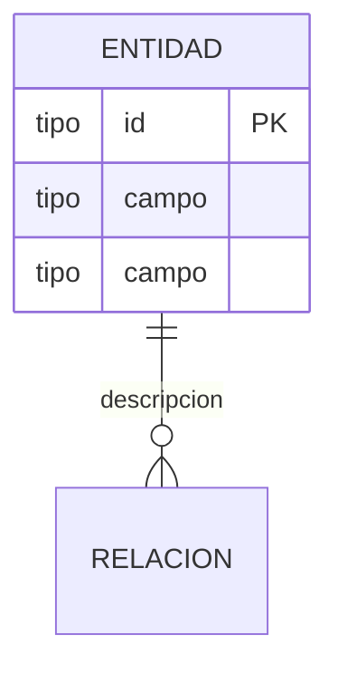

# Template: DATABASE.md

Usa esta plantilla cuando el usuario solicite crear o actualizar `DATABASE.md` en `docs/`.

## Estructura

```markdown
# 🗄️ Modelo de Base de Datos

## Diagrama ERD


```

## Diccionario de Datos

### `{nombre_tabla}`

| Campo | Tipo | Constraints | Descripción |
|---|---|---|---|
| id | UUID | PK, DEFAULT gen_random_uuid() | Identificador único |
| created_at | TIMESTAMPTZ | NOT NULL, DEFAULT NOW() | Fecha de creación |

**Nota:** Campos marcados con 🚧 son de Alcance Futuro / Post-MVP.

## Índices y Optimización

| Índice | Tabla | Campo | Tipo |
|---|---|---|---|
| idx_ejemplo | tabla | campo | B-tree |

## Políticas de Seguridad (RLS)

```sql
CREATE POLICY policy_name ON table_name
  USING (user_id = auth.uid());
```

## 🔗 Referencias

- [🏗️ Arquitectura Técnica](ARCHITECTURE.md)
- [🤝 Contratos de Interfaz](CONTRACTS.md)
- [🧠 Lógica Core e Inferencia](MODEL.md)
- [🗺️ Roadmap de Producto](ROADMAP.md)
- [🎯 Alcance MVP](SCOPE.md)
```

## Reglas

- Usa `erDiagram` de Mermaid para el modelo entidad-relación.
- Separa explícitamente MVP de Alcance Futuro en el diccionario.
- Incluye constraints (PK, FK, UNIQUE, NOT NULL, DEFAULT).
- No uses la palabra "Beta".
