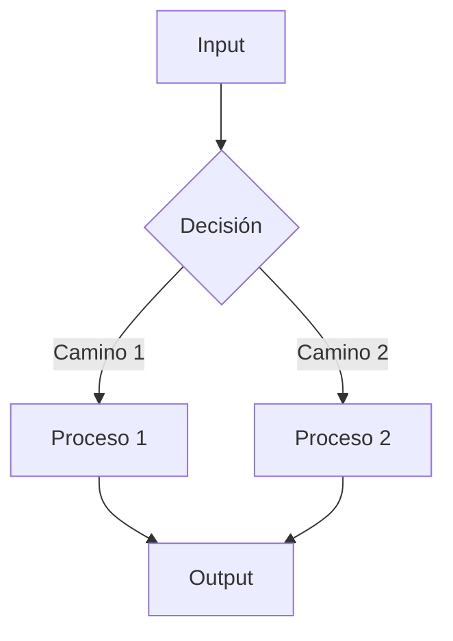

# Template: MODEL.md / LOGIC.md

Usa esta plantilla cuando el usuario solicite crear o actualizar `MODEL.md` en `docs/`. Si el proyecto es puramente backend sin ML, usa el nombre `LOGIC.md`.

## Estructura

```markdown
# 🧠 {Lógica Core / Modelo / Inferencia}

## Algoritmo Principal

Explica en detalle el algoritmo o lógica de negocio principal. Usa notación LaTeX
si es matemático: \(A = B \times C\).

## Flujo de Ejecución


```

## Inputs / Outputs

**Input:**
```json
{
  "campo": "tipo | descripción"
}
```

**Output:**
```json
{
  "campo": "tipo | descripción"
}
```

## Parámetros y Configuración

| Parámetro | Valor por Defecto | Descripción |
|---|---|---|
| threshold | 0.8 | Umbral de decisión |

## 🔗 Referencias

- [🏗️ Arquitectura Técnica](ARCHITECTURE.md)
- [🤝 Contratos de Interfaz](CONTRACTS.md)
- [🗄️ Modelo de Base de Datos](DATABASE.md)
- [🗺️ Roadmap de Producto](ROADMAP.md)
- [🎯 Alcance MVP](SCOPE.md)
```

## Reglas

- Usa LaTeX para fórmulas matemáticas (encerrado en `\(...\)`).
- Usa Mermaid `flowchart` para el flujo de ejecución.
- Clasifica como **MVP** o **Alcance Futuro / Post-MVP**.
- No uses la palabra "Beta".
