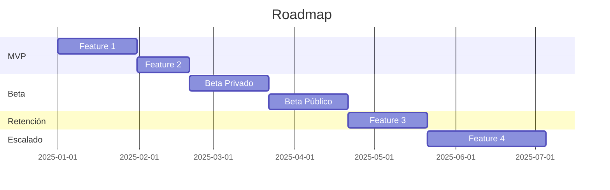

# Template: ROADMAP.md

Usa esta plantilla cuando el usuario solicite crear o actualizar `ROADMAP.md` en `docs/`.

## Estructura

```markdown
# 🗺️ Roadmap de Producto

## Línea de Tiempo


```

## Fases

### Fase 1: MVP (Ingeniería y Validación Core)
| Feature | Descripción | Prioridad |
|---|---|---|
| Feature A | Descripción | Alta |

### Fase 2: Beta (Distribución y UX)
| Hito | Descripción | Fecha Estimada |
|---|---|---|
| Beta Privado | Acceso controlado | Q1 2025 |

### Fase 3: Retención (Features Adicionales)
| Feature | Descripción |
|---|---|
| Feature C | Descripción |

### Fase 4: Escalado y Monetización
| Iniciativa | Descripción |
|---|---|
| B2B | APIs empresariales |

## 🔗 Referencias

- [🏗️ Arquitectura Técnica](ARCHITECTURE.md)
- [🤝 Contratos de Interfaz](CONTRACTS.md)
- [🗄️ Modelo de Base de Datos](DATABASE.md)
- [🧠 Lógica Core e Inferencia](MODEL.md)
- [🎯 Alcance MVP](SCOPE.md)
```

## Reglas

- Usa Mermaid `gantt` para la línea de tiempo visual.
- La palabra "Beta" SOLO está permitida aquí para describir la estrategia de release.
- No uses "Beta" para definir código sprints o deliverables MVP.
