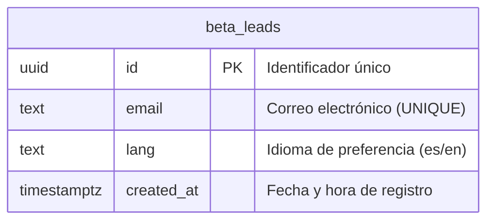

# 🗄️ Modelo de Base de Datos

Este documento define la estructura de datos utilizada para el almacenamiento persistente en la base de datos de producción (Supabase/PostgreSQL).

## Diagrama ERD



## Diccionario de Datos

### `beta_leads`

La tabla `beta_leads` almacena las solicitudes de registro para la lista de espera de la beta privada.

| Campo        | Tipo          | Constraints                               | Descripción                                        |
| :----------- | :------------ | :---------------------------------------- | :------------------------------------------------- |
| `id`         | `uuid`        | PK, NOT NULL, DEFAULT `gen_random_uuid()` | Identificador único del lead.                      |
| `email`      | `text`        | UNIQUE, NOT NULL                          | Dirección de correo electrónico validada.          |
| `lang`       | `text`        | NOT NULL                                  | Idioma del navegador al registrarse (`es` o `en`). |
| `created_at` | `timestamptz` | NOT NULL, DEFAULT `now()`                 | Fecha y hora UTC del registro.                     |

## Índices y Optimización

| Índice                 | Tabla        | Campo   | Tipo            | Propósito                                              |
| :--------------------- | :----------- | :------ | :-------------- | :----------------------------------------------------- |
| `beta_leads_pkey`      | `beta_leads` | `id`    | B-tree          | Clave primaria por defecto.                            |
| `beta_leads_email_key` | `beta_leads` | `email` | B-tree (UNIQUE) | Optimizar consultas de existencia y evitar duplicados. |

## Políticas de Seguridad (RLS)

La base de datos se consume de forma exclusiva a través del backend (`Route Handler` en Next.js), utilizando una clave de rol de servicio (`SUPABASE_SERVICE_ROLE_KEY`), por lo que las políticas de seguridad a nivel cliente están desactivadas por defecto:

```sql
-- Habilitar Row Level Security (RLS) en la tabla
ALTER TABLE beta_leads ENABLE ROW LEVEL SECURITY;

-- Denegar todo el acceso directo no autenticado desde el cliente API público
CREATE POLICY "Deny all public access" ON beta_leads
  FOR ALL
  TO public
  USING (false);
```

> **Decisión:** El backend gestiona de forma segura la inserción de datos de leads mediante credenciales privilegiadas (`service_role`), aislando por completo la base de datos de las consultas no autorizadas en el frontend del cliente.

## 🔗 Referencias

- [🏗️ Arquitectura Técnica](ARCHITECTURE.md)
- [🤝 Contratos de Interfaz](CONTRACTS.md)
- [🗺️ Roadmap de Producto](ROADMAP.md)
- [🎯 Alcance MVP](SCOPE.md)
