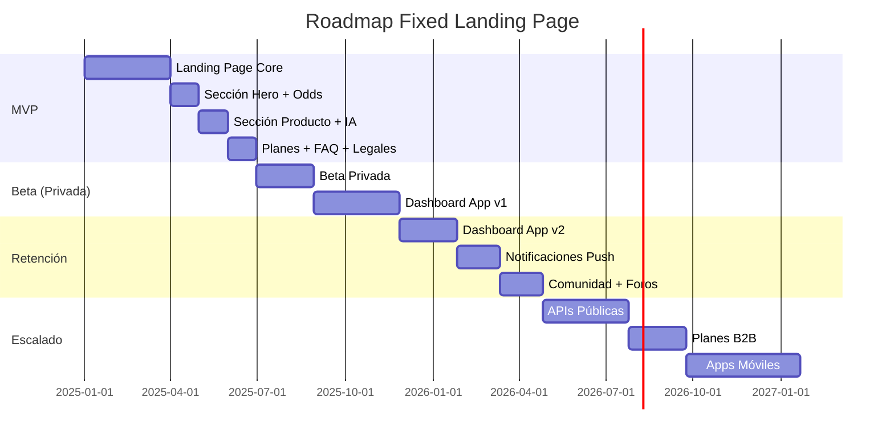

# 🗺️ Roadmap de Producto

## Línea de Tiempo

## Fases

### Fase 1: MVP — Landing Page (Actual)

| Feature                                             | Estado     | Prioridad |
| --------------------------------------------------- | ---------- | --------- |
| Hero Section con captura de email (Supabase)        | Completado | Alta      |
| OddsMarquee (predicciones en vivo)                  | MVP        | Alta      |
| KeyPointsGrid (métricas)                            | MVP        | Alta      |
| ScrollExpandVideo (dashboard reveal)                | MVP        | Alta      |
| AITimeline + AILayers (proceso IA)                  | MVP        | Alta      |
| DataStreamMarquee (terminal)                        | MVP        | Media     |
| BrandsCarousel (partners)                           | MVP        | Media     |
| Sistema de traducción EN/ES                         | MVP        | Alta      |
| Páginas: Planes, FAQ, Términos, Privacidad, Cookies | MVP        | Alta      |
| Toolbar + Footer (con BetaForm interactivo)         | Completado | Alta      |

### Fase 2: Beta Privada (Distribución y UX)

| Hito             | Descripción                                                                   | Fecha Estimada |
| ---------------- | ----------------------------------------------------------------------------- | -------------- |
| Beta Privada     | Acceso controlado con invitación. Dashboard de predicciones reales.           | Q1 2026        |
| Dashboard App v1 | Plataforma web en `app.fixed.com` con login, predicciones en vivo, historial. | Q2 2026        |

### Fase 3: Retención

| Feature             | Descripción                                                        |
| ------------------- | ------------------------------------------------------------------ |
| Dashboard v2        | Alertas personalizadas, filtros avanzados, estadísticas de usuario |
| Notificaciones Push | Alertas en tiempo real de oportunidades detectadas                 |
| Comunidad           | Foros de discusión, rankings, tipsters verificados                 |

### Fase 4: Escalado y Monetización

| Iniciativa    | Descripción                                              |
| ------------- | -------------------------------------------------------- |
| APIs Públicas | APIs de predicciones para integración de terceros        |
| Planes B2B    | Suscripciones enterprise para casas de apuestas y medios |
| Apps Móviles  | iOS y Android con notificaciones push nativas            |

## 🔗 Referencias

- [🏗️ Arquitectura Técnica](ARCHITECTURE.md)
- [🤝 Contratos de Interfaz](CONTRACTS.md)
- [🗄️ Modelo de Base de Datos](DATABASE.md)
- [🎯 Alcance MVP](SCOPE.md)
- [🎨 Sistema de Diseño](../DESIGN.md)
